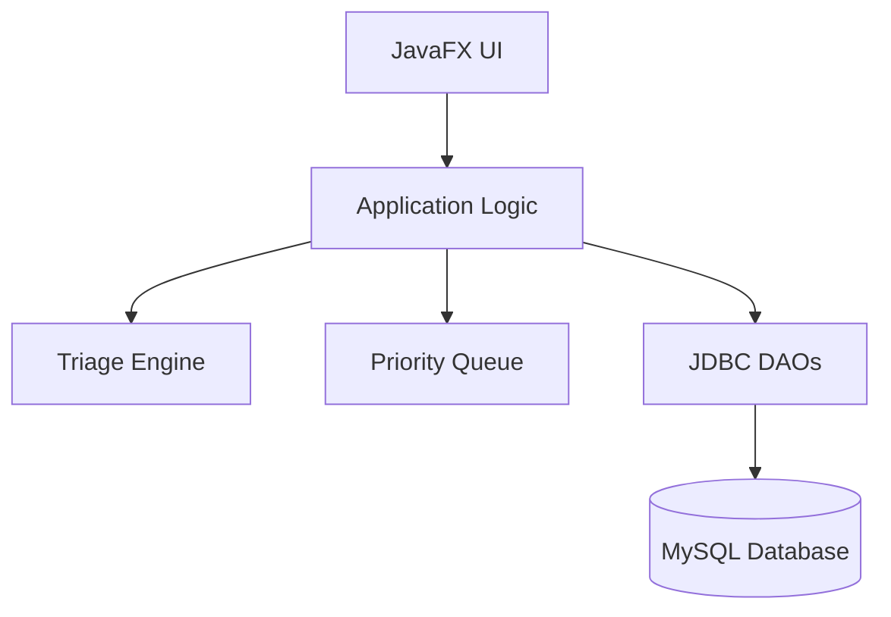

# Design Document Template

## Overview 
This feature delivers a strict Java-based implementation of the MediKiosk platform to patients, triage officers, physicians, and administrators. 
Patients will utilize this for intake registration and symptom reporting. Physicians and administrators will use it for managing triage queues and hospital operations.
Changes the current system state by establishing a completely new greenfield Java application using JavaFX and MySQL, replacing the original web-based architecture.

### Goals
- Implement a JavaFX frontend with views for Patients, Physicians, and Admins.
- Build a Core Java backend leveraging OOP, Collections, and custom Data Structures.
- Integrate a Rule-Based AI Engine for automated triage scoring.
- Connect to a MySQL database using pure JDBC for persistence.

### Non-Goals
- Complex multi-threading or distributed systems architecture.
- Use of ORMs (Hibernate/JPA) or modern web frameworks (Spring).
- Cloud AI APIs integration.

## Boundary Commitments

### This Spec Owns
- The JavaFX user interface for all four required roles.
- The Core Java application logic, custom priority queue data structure, and rule-based AI engine.
- The raw JDBC data access layer and MySQL schema definitions.

### Out of Boundary
- Database installation/hosting (assumes local MySQL instance is available).
- Patient authentication or external identity providers.

### Allowed Dependencies
- Java SE (Core Java)
- JavaFX SDK
- MySQL Connector/J (JDBC driver)

### Revalidation Triggers
- Changes to the database schema structure.
- Upgrades to newer Java/JavaFX versions causing UI rendering changes.

## Architecture

### Architecture Pattern & Boundary Map
**Architecture Integration**:
- Selected pattern: Monolithic MVC (Model-View-Controller) tailored for JavaFX.
- Domain/feature boundaries: Clear separation between UI (`ui`), Business Logic (`services`, `ai`), Data Structures (`datastructures`), Data Access (`dao`), and Domain Models (`models`).
- New components rationale: A custom `PatientQueue` wrapping standard Collections to fulfill the syllabus requirement for Data Structures. `TriageEngine` fulfills the AI requirement.



### Technology Stack

| Layer | Choice / Version | Role in Feature | Notes |
|-------|------------------|-----------------|-------|
| Frontend | JavaFX 17+ | Renders the GUI | MVC architecture |
| Backend | Core Java 17+ | Business logic, Data Structures, AI | No Spring/JavaEE |
| Data | MySQL 8.0, JDBC | Persistence | Raw SQL queries |

## File Structure Plan

### Directory Structure
```
src/
├── com/medikiosk/
│   ├── Main.java              # JavaFX Application Entry point
│   ├── models/                # OOP Domain Models
│   │   ├── Patient.java       # Encapsulates patient details
│   │   └── Assessment.java    # Encapsulates intake symptoms and score
│   ├── datastructures/        # Collections and Structures
│   │   └── PatientQueue.java  # Custom priority queue for triage
│   ├── ai/                    # Artificial Intelligence
│   │   └── TriageEngine.java  # Rule-based expert system
│   ├── dao/                   # JDBC Data Access
│   │   ├── DatabaseConnection.java
│   │   └── PatientDAO.java
│   ├── services/              # Application Logic
│   │   └── KioskService.java  # Facade coordinating logic
│   └── ui/                    # JavaFX Controllers
│       ├── PatientController.java
│       ├── PhysicianController.java
│       └── AdminController.java
```

## Requirements Traceability

| Requirement | Summary | Components | Interfaces |
|-------------|---------|------------|------------|
| 1 | Patient Intake | PatientController, KioskService, PatientDAO | `registerPatient()` |
| 2 | Automated Triage | TriageEngine, KioskService, PatientQueue | `calculateSeverity()` |
| 3 | Physician Queue | PhysicianController, PatientQueue, KioskService | `getNextPatient()` |
| 4 | Admin Dashboard | AdminController, KioskService, PatientDAO | `getDailyMetrics()` |

## Components and Interfaces

### UI Layer

#### Controllers
| Field | Detail |
|-------|--------|
| Intent | Manages JavaFX views and user interactions |
| Requirements | 1, 3, 4 |

**Responsibilities & Constraints**
- Captures input and updates the UI state.
- Delegates business logic to `KioskService`.

### Services Layer

#### KioskService
| Field | Detail |
|-------|--------|
| Intent | Core facade coordinating the backend |
| Requirements | 1, 2, 3, 4 |

**Dependencies**
- Outbound: `TriageEngine` (P0), `PatientDAO` (P0), `PatientQueue` (P0)

##### Service Interface
```java
public interface IKioskService {
    void registerPatient(Patient patient, Assessment assessment);
    List<Patient> getLivePhysicianQueue();
    void completeConsultation(int patientId);
    DashboardMetrics getAdminMetrics();
}
```

### AI Layer

#### TriageEngine
| Field | Detail |
|-------|--------|
| Intent | Rule-based AI evaluating symptom severity |
| Requirements | 2 |

**Responsibilities & Constraints**
- Pure logic class. No database access.
- Assigns a numerical severity score based on hardcoded medical heuristics.

##### Service Interface
```java
public class TriageEngine {
    public int calculateSeverityScore(List<String> symptoms);
    public String determinePriorityTier(int score); // "Red", "Yellow", "Green"
}
```

### Data Access Layer

#### PatientDAO
| Field | Detail |
|-------|--------|
| Intent | Manages CRUD operations for Patient and Assessment via JDBC |
| Requirements | 1, 4 |

**Responsibilities & Constraints**
- Executes raw `PreparedStatement` SQL queries against MySQL.

## Data Models

### Domain Model
- **Patient**: `id`, `name`, `age`, `contactInfo`
- **Assessment**: `id`, `patientId`, `symptoms`, `severityScore`, `priorityTier`, `status`

### Logical Data Model
**Patients Table**:
- `patient_id` (INT, PK, Auto-increment)
- `name` (VARCHAR)
- `contact_info` (VARCHAR)

**Assessments Table**:
- `assessment_id` (INT, PK, Auto-increment)
- `patient_id` (INT, FK)
- `symptoms` (VARCHAR)
- `severity_score` (INT)
- `priority_tier` (VARCHAR)
- `status` (VARCHAR) - "WAITING", "COMPLETED"

## Error Handling

### Error Strategy
- **User Errors**: Form validation in JavaFX controllers (e.g., missing fields trigger popup alerts).
- **System Errors**: JDBC `SQLException`s are caught in the DAO layer, logged, and rethrown as custom runtime exceptions to the UI layer for graceful failure displays.

## Testing Strategy
- **Unit Tests**: Test `TriageEngine` scoring logic with different symptom combinations.
- **Integration Tests**: Verify `PatientDAO` correctly inserts and retrieves records from a local MySQL instance.
- **E2E/UI Tests**: Manually launch JavaFX application, register a patient, verify queue order updates in the Physician view.
